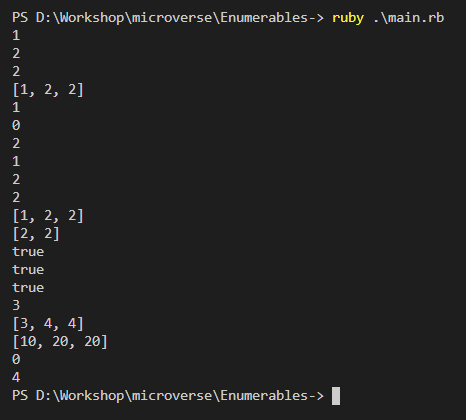

## Week 5

# Project 2 - Ruby : Enumerables

## Screen Shot

In this project, we re-create most of the Enumerable methods using 
- Loops
- Blocks and Yield Keyword
- Procs and Call method

You can find the original project specification at: https://github.com/TheOdinProject/curriculum/blob/master/archive/old_lessons/ruby/basic_ruby/project_advanced_building_blocks.md#project-2-enumerable-methods

## Built With

- Ruby

## Getting Started

Follow these steps to get a local copy up and running :

1. Install `git` on your local machine.
1. Type `git init` in the Terminal.
1. Clone the repository to your local machine `git clone https://github.com/wandji20/Enumerables-.git`.
1. Cd into the repository `cd Enumerables-`.
1. Open the `main.rb` file and run it with your editor, or excute the file using ruby runtime `ruby main.rb`

## Authors

**Wandji Bertrand**

- GitHub: [@wandji20](https://github.com/wandji20)

**Omar Rashad**

- GitHub: [@od-c0d3r](https://github.com/od-c0d3r)

## Contributing

Contributions, issues, and feature requests are welcome!

## Show your support

Give a star if you like this project!
